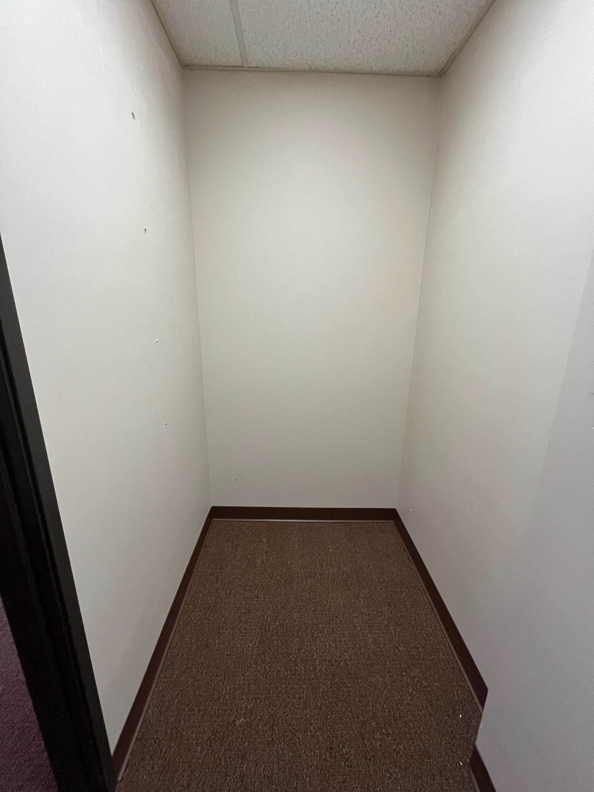
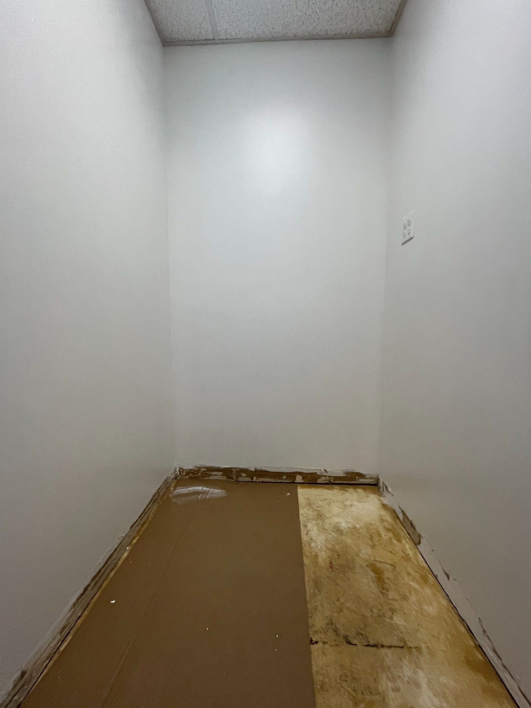
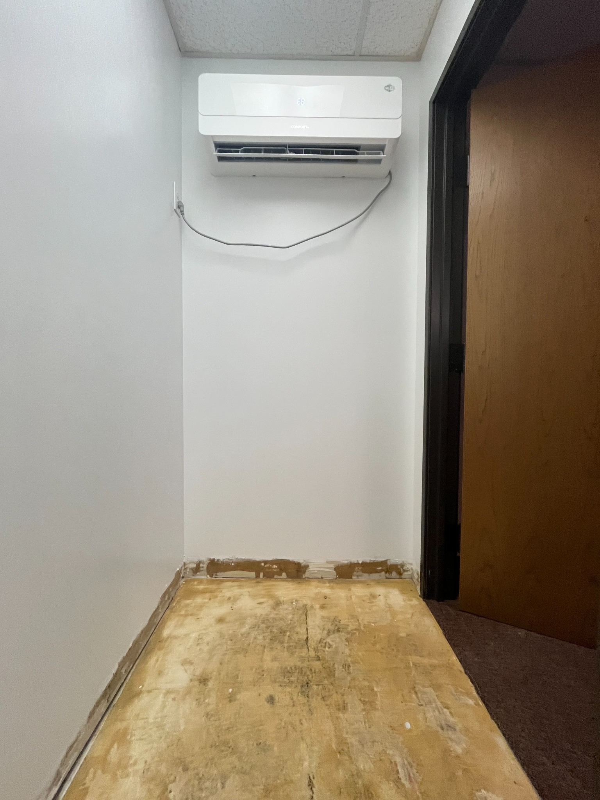
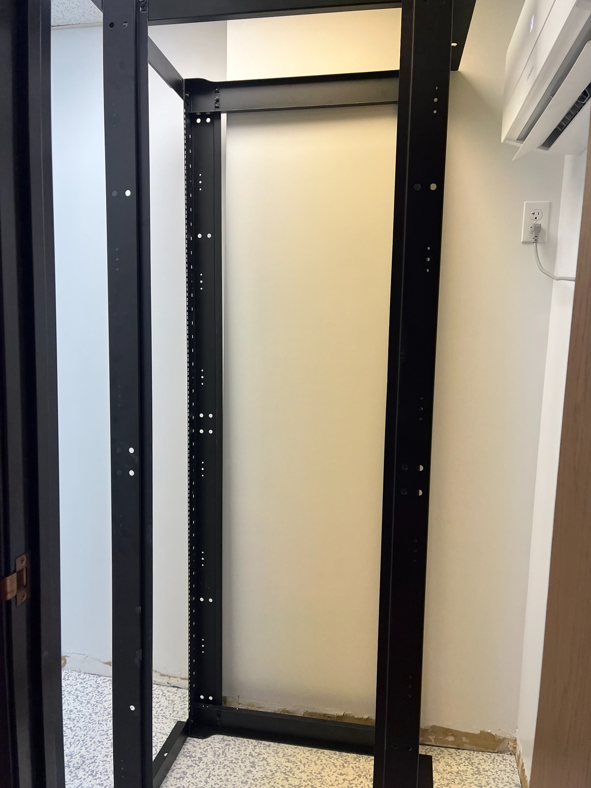
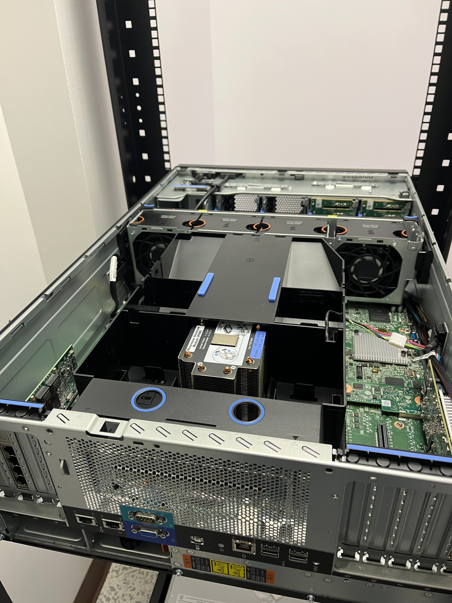
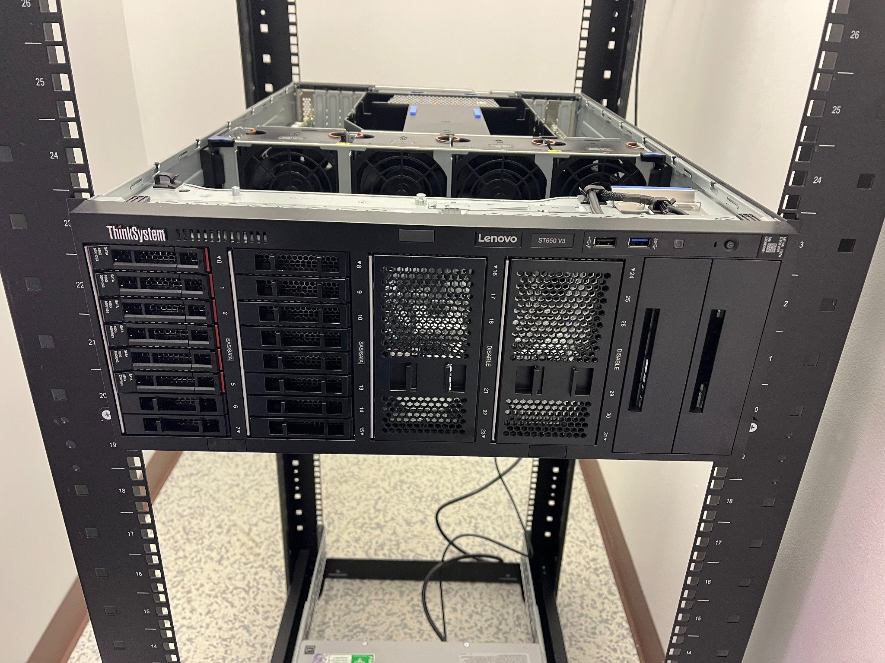
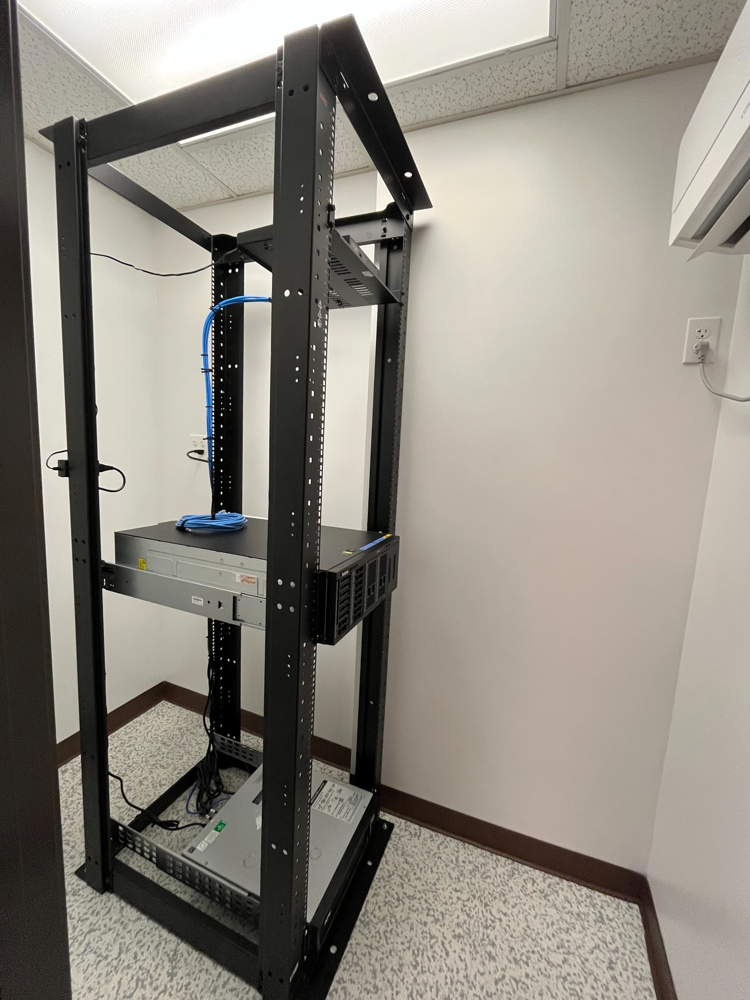
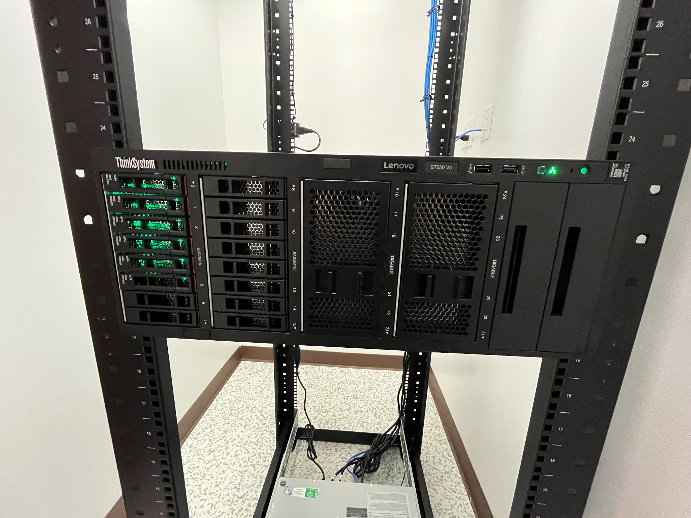
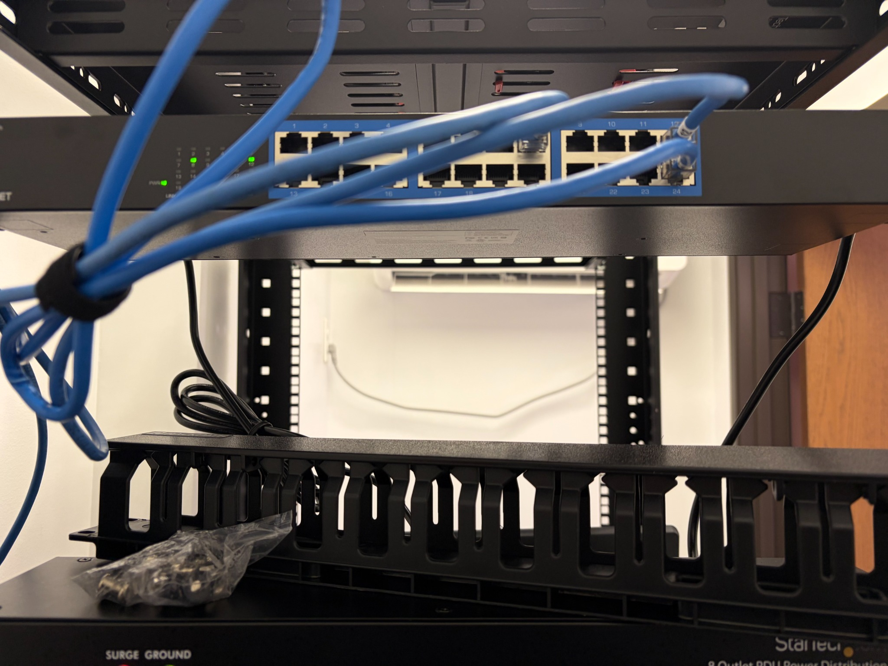

# Dedicated Server Room Buildout

**Concept to production in approximately three months**

A workplace infrastructure project that transformed an unused office closet into a dedicated server room supporting production compute, storage, networking, and security infrastructure.

The finished environment includes dedicated cooling, static-safe flooring, rack-mounted infrastructure, structured power distribution, organized cabling, centralized storage, and production server hardware.

---

## Before & After

<table>
<tr>
<td width="50%" align="center"><strong>Before</strong></td>
<td width="50%" align="center"><strong>Production Environment</strong></td>
</tr>
<tr>
<td width="50%">

</td>
<td width="50%">

</td>
</tr>
</table>

---

## Project Overview

The organization needed a dedicated location for growing server, storage, and network infrastructure.

The available space was originally a small office closet with standard carpet, no equipment rack, and no infrastructure designed specifically for continuous IT operation.

I led the project from initial concept through room planning, infrastructure preparation, rack deployment, hardware installation, network integration, testing, and final production use.

The project took approximately three months from concept to production.

---

## The Challenge

The original room was general office space rather than an IT equipment environment.

Key requirements included:

- Creating a dedicated location for production infrastructure
- Replacing standard carpet with a more appropriate static-control surface
- Adding dedicated environmental cooling
- Planning rack placement within a constrained room
- Establishing structured power distribution
- Designing serviceable network and power cable paths
- Providing front and rear access to equipment
- Consolidating server, storage, networking, and security hardware
- Leaving room for future growth

The goal was not simply to install a rack. The room needed to function as a maintainable production infrastructure environment.

---

## My Role

I was responsible for taking the server-room project from concept through production deployment.

My work included:

- Evaluating the available space
- Defining infrastructure requirements
- Planning the physical room layout
- Coordinating room preparation
- Planning rack placement and rack-unit usage
- Integrating dedicated environmental controls
- Incorporating static-control flooring
- Deploying and organizing the equipment rack
- Installing server and storage hardware
- Integrating network and security equipment
- Implementing rack-mounted power distribution
- Routing and managing network cabling
- Validating systems as they were brought online
- Transitioning the completed environment into production use

This project combined infrastructure planning, systems administration, networking, hardware deployment, facilities coordination, and project execution.

---

## Build Process

### Phase 1 — Space Assessment

The project began with an unused office closet.

The initial design had to account for rack dimensions, equipment depth, service access, power availability, cooling, cable routing, static protection, and future expansion.

---

### Phase 2 — Room Preparation

The existing carpet was removed so the room could be converted into a more appropriate environment for production IT equipment.

The floor and room were then prepared for the infrastructure buildout.

---

### Phase 3 — Static-Control Flooring

Static-safe flooring was incorporated to reduce electrostatic-discharge risk around sensitive electronic equipment.

Replacing standard office carpet was an important part of converting the room into a dedicated infrastructure space.

---

### Phase 4 — Environmental Controls

A dedicated ductless cooling system was incorporated so the server room temperature could be managed independently from the surrounding office environment.

This was important because server, storage, networking, and power equipment generate continuous heat loads and require a more controlled operating environment.

---

### Phase 5 — Rack Deployment

A full-height open-frame equipment rack became the physical foundation of the new server room.

Rack placement was chosen to preserve access to both the front and rear of the equipment while making efficient use of the available space.

The rack established a structured location for:

- Servers
- Storage systems
- Network equipment
- Security appliances
- Power distribution
- Cable management
- Future expansion

---

### Phase 6 — Grounding, Power & Serviceability

The room and rack were prepared for safe and maintainable equipment deployment.

Rack-mounted power distribution was used to create a cleaner and more serviceable power layout than ad hoc device connections.

---

### Phase 7 — Server Hardware Deployment

Production server hardware was prepared, installed, and integrated into the rack.

The deployment included physical mounting, hardware preparation, network connectivity, power integration, and system validation.

---

### Phase 8 — Rack Buildout

The rack was progressively populated with compute, storage, networking, and supporting infrastructure.

Systems were brought online and validated as the build progressed.

---

### Phase 9 — Network & Power Distribution

Network switching and rack-mounted power distribution were incorporated into the final layout.

Cable-management hardware was used to keep connections organized while retaining enough service slack for future maintenance and equipment replacement.

---

### Phase 10 — Storage & Security Infrastructure

Storage and network-security infrastructure were centralized in the server room.

The environment now provides a dedicated physical location for production compute, storage, networking, and security systems.

---

## Production Environment

The completed room includes:

- Enterprise server hardware
- Network-attached storage
- Network switching
- Network security infrastructure
- Rack-mounted power distribution
- Structured cable-management hardware
- Dedicated environmental cooling
- Static-safe flooring
- Local service and management capability
- Capacity for future infrastructure growth

The space transitioned from an unused office closet into active production infrastructure in approximately three months.

---

## Results

| Area | Before | After |
| --- | --- | --- |
| Room purpose | General office closet | Dedicated production server room |
| Flooring | Standard carpet | Static-safe flooring |
| Cooling | General office environment | Dedicated environmental control |
| Equipment mounting | None | Full-height infrastructure rack |
| Compute | No dedicated server location | Centralized production server hardware |
| Storage | No dedicated room | Centralized network storage |
| Networking | No rack-based layout | Structured rack-based networking |
| Security | Distributed infrastructure | Centralized network-security equipment |
| Power | General-purpose connections | Rack-mounted power distribution |
| Cabling | No structured routing | Defined cable-management paths |
| Serviceability | No infrastructure layout | Front and rear equipment access |
| Scalability | No defined expansion model | Rack capacity for future systems |

---

## Operational Improvements

### Centralized Infrastructure

Server, storage, network, and security equipment now reside in a dedicated infrastructure environment rather than being distributed through general office space.

### Environmental Stability

Dedicated cooling allows the server room to be managed independently from normal office temperature requirements.

### Static Protection

Replacing carpet with static-safe flooring created a more appropriate environment for sensitive electronic equipment.

### Maintainability

Rack-based deployment provides structured access to individual systems and makes hardware replacement, troubleshooting, inspection, and upgrades easier.

### Cable Management

Defined network and power routes make physical connectivity easier to understand and reduce disruption during maintenance.

### Scalability

Available rack capacity and structured infrastructure provide room for additional servers, storage, networking, and supporting systems as requirements grow.

---

## Project Timeline

The project moved from concept to production use over approximately three months:

1. Concept and requirements
2. Room assessment
3. Infrastructure design
4. Room preparation
5. Static-control flooring
6. Environmental-control integration
7. Rack deployment
8. Power and cable management
9. Server and storage deployment
10. Network and security integration
11. System validation
12. Production use

---

## Technologies & Skills

`Server Infrastructure` ·
`Network Infrastructure` ·
`Systems Administration` ·
`Server Hardware` ·
`Rack Infrastructure` ·
`Structured Cabling` ·
`Ethernet` ·
`Network Security` ·
`SonicWall` ·
`Network Switching` ·
`Synology NAS` ·
`Power Distribution` ·
`Environmental Controls` ·
`ESD Mitigation` ·
`Infrastructure Planning` ·
`Hardware Deployment` ·
`Project Management` ·
`Troubleshooting`

---

## Project Takeaway

This project required thinking beyond individual servers or network devices and designing the physical environment those systems depend on.

Cooling, power, static protection, equipment placement, service access, cable routing, and expansion capacity all affect the reliability and maintainability of production IT infrastructure.

Taking the project from an empty office closet to an operational server room provided hands-on experience across the complete infrastructure lifecycle:

**Planning → Facilities Preparation → Rack Deployment → Hardware Integration → Networking → Validation → Production**

The result is a dedicated infrastructure environment better suited to supporting current systems and future growth.

---

## Public Portfolio Note

This repository is a sanitized portfolio representation of professional work.

Production addressing, credentials, serial numbers, configuration details, internal documentation, and other sensitive operational information are intentionally excluded.
