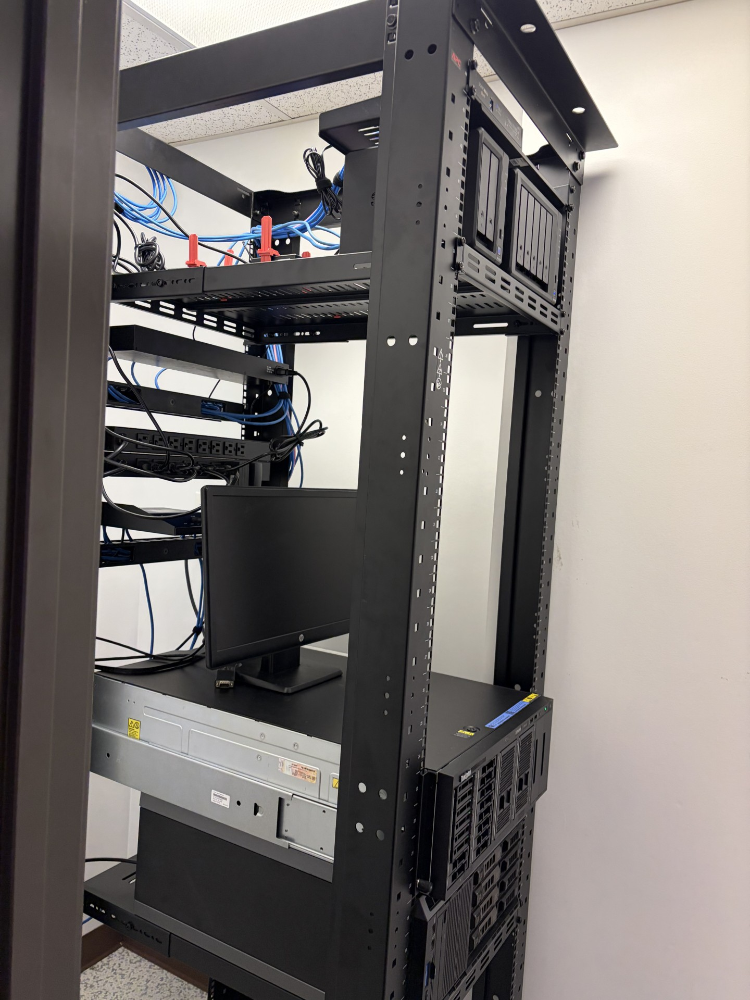
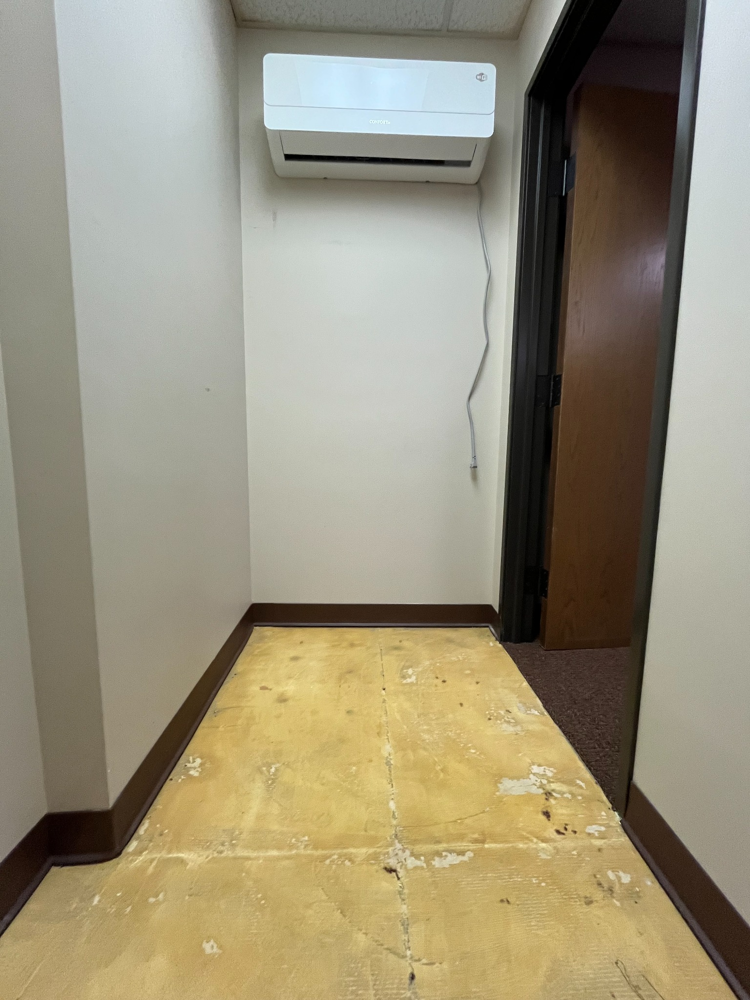
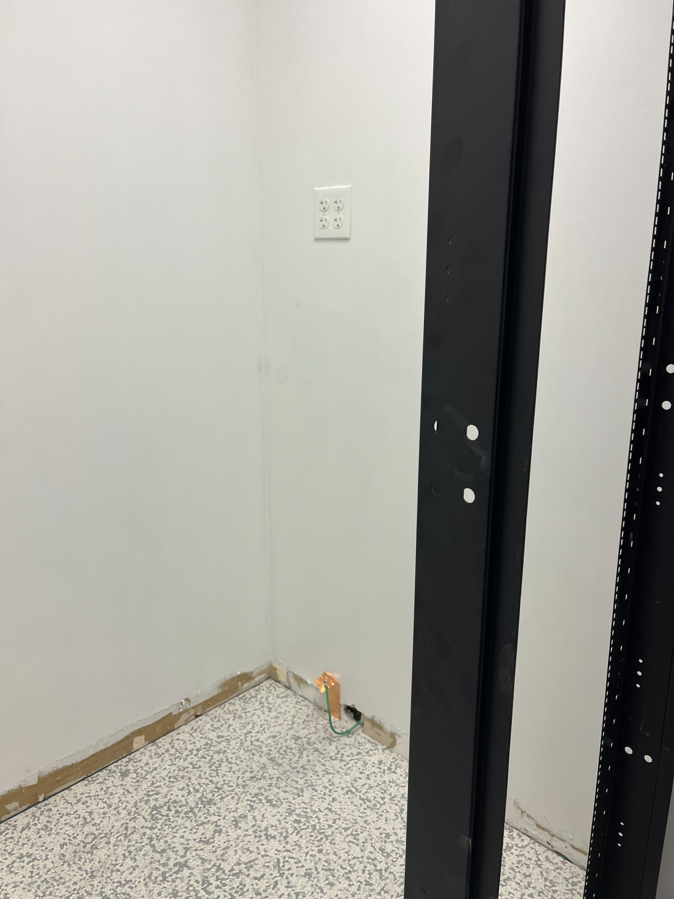
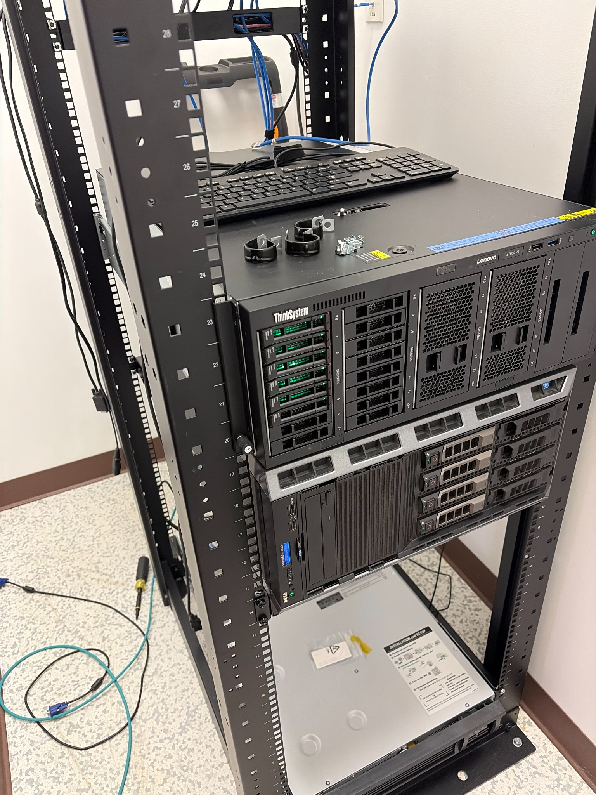
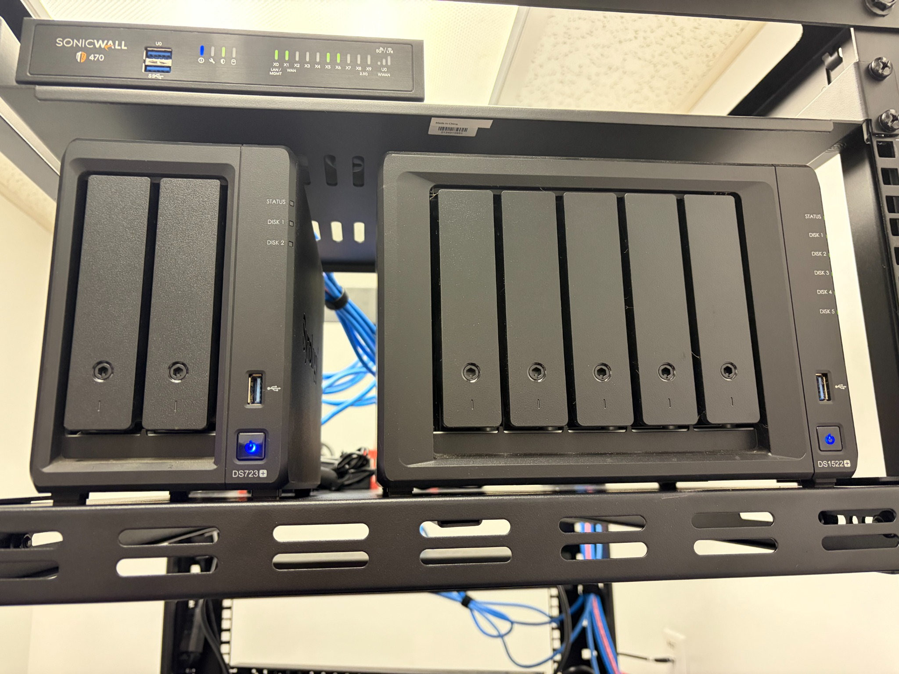

# Dedicated Server Room Buildout & Production Infrastructure Deployment

**Concept to production in approximately three months**

A workplace infrastructure project that transformed an unused office closet into a dedicated production server room with environmental controls, static-safe flooring, rack-mounted compute and storage, network security, structured power distribution, and organized cabling.

---

## Before & After

<table>
<tr>
<td width="50%" align="center"><strong>Before</strong></td>
<td width="50%" align="center"><strong>Production Environment</strong></td>
</tr>
<tr>
<td width="50%">

</td>
<td width="50%">

</td>
</tr>
</table>

---

## Project Overview

The organization needed a dedicated location for growing server, storage, network, and security infrastructure.

The available space was originally a small office closet with standard carpet, no equipment rack, and no physical environment designed for continuous IT operation.

Over approximately three months, I took the project from concept through room preparation, environmental-control integration, rack deployment, hardware installation, network integration, validation, and production use.

The result was a centralized infrastructure environment designed around maintainability, service access, thermal control, static mitigation, and future expansion.

---

## The Challenge

The original room was general office space rather than an IT equipment environment.

Key requirements included:

- Converting an unused closet into dedicated infrastructure space
- Removing standard carpet
- Providing dedicated cooling
- Introducing a static-safe floor system
- Planning a full-height rack within a constrained room
- Establishing structured rack power
- Creating serviceable network and power cable paths
- Providing front and rear equipment access
- Centralizing compute, storage, networking, and security hardware
- Preserving capacity for future growth

The goal was not simply to install equipment in a closet. The room needed to become a maintainable production infrastructure environment.

---

## My Role

I was responsible for taking the project from initial concept through production deployment.

My work included:

- Evaluating the available space
- Defining infrastructure requirements
- Planning the physical room layout
- Coordinating room preparation
- Planning rack placement and rack-unit utilization
- Integrating dedicated environmental controls
- Incorporating static-control flooring and grounding provisions
- Deploying and organizing the equipment rack
- Installing server and storage hardware
- Integrating network and security equipment
- Implementing rack-mounted power distribution
- Routing and managing network cabling
- Validating systems as they were brought online
- Transitioning the completed environment into production use

This project combined infrastructure planning, systems administration, networking, hardware deployment, facilities coordination, and project execution.

---

# Build Process

The images below are presented in project sequence.

## Phase 1 — Original Space Assessment

The project began with an unused office closet.

The initial design had to account for rack dimensions, equipment depth, service access, power, cooling, cable routing, static protection, and future expansion.

---

## Phase 2 — Cooling Installation & Carpet Removal

The room was prepared for infrastructure use by removing the original carpet and adding dedicated environmental control.

A dedicated ductless cooling system allows the room temperature to be controlled independently from normal office comfort requirements.

---

## Phase 3 — Floor Preparation

After carpet removal, the underlying floor was cleaned and prepared for the static-control flooring system.

This step prepared the room for a floor surface more appropriate for sensitive electronic equipment.

---

## Phase 4 — Static-Control Flooring & Rack Placement

Static-safe flooring was installed and the full-height open-frame rack was positioned in the room.

Rack placement was selected to preserve front and rear service access while making efficient use of the limited room dimensions.

---

## Phase 5 — ESD & Electrical Provisions

Grounding provisions were incorporated as part of the room's static-control and electrical preparation.

The objective was to create a physical environment better suited to sensitive IT equipment than the original carpeted office space.

---

## Phase 6 — Server Hardware Preparation

Production server hardware was prepared before final rack integration.

Hardware preparation included inspection, component installation, mounting preparation, and readiness checks before the systems were placed into service.

---

## Phase 7 — Initial Compute Deployment

The first production server was installed into the rack.

The deployment included physical mounting, network connectivity, power integration, and system validation.

---

## Phase 8 — Rack Buildout

The rack was progressively populated with compute and supporting infrastructure.

This stage established the physical organization that would support the production environment.

---

## Phase 9 — System Validation

Systems were powered on and validated as the deployment progressed.

Validation included confirming hardware operation, network connectivity, and readiness before the environment was placed into regular production use.

---

## Phase 10 — Expanded Compute Deployment

Additional server capacity was integrated as the rack buildout matured.

The rack design retained space and service access for multiple production systems and future expansion.

---

## Phase 11 — Network Integration & Cable Management

Network switching and structured cabling were incorporated into the rack.

Cable-management hardware and defined routing paths improved physical organization and made connections easier to trace and service.

---

## Phase 12 — Storage & Network Security

Centralized storage and network-security infrastructure were integrated into the server room.

The completed environment centralized major compute, storage, networking, and security functions into one managed physical location.

---

## Phase 13 — Production Environment

The completed room transitioned into production use after approximately three months of planning, facilities preparation, hardware deployment, integration, and validation.

The production environment includes:

- Enterprise server hardware
- Network-attached storage
- Ethernet switching
- Network security infrastructure
- Rack-mounted power distribution
- Structured cable-management hardware
- Dedicated environmental cooling
- Static-safe flooring
- Local service and management capability
- Capacity for future infrastructure growth

---

## Results

| Area | Before | After |
| --- | --- | --- |
| Room purpose | General office closet | Dedicated production server room |
| Flooring | Standard carpet | Static-safe flooring |
| Cooling | General office environment | Dedicated environmental control |
| Equipment mounting | None | Full-height infrastructure rack |
| Compute | No dedicated server location | Centralized production server hardware |
| Storage | No dedicated room | Centralized network storage |
| Networking | No rack-based layout | Structured rack-based networking |
| Security | Distributed infrastructure | Centralized network-security equipment |
| Power | General-purpose connections | Rack-mounted power distribution |
| Cabling | No structured routing | Defined cable-management paths |
| Serviceability | No infrastructure layout | Front and rear equipment access |
| Scalability | No defined expansion model | Rack capacity for future systems |

---

## Operational Improvements

### Centralized Infrastructure

Server, storage, network, and security equipment now reside in a dedicated infrastructure environment rather than being distributed through general office space.

### Environmental Stability

Dedicated cooling allows the server room temperature to be managed independently from the surrounding office environment.

### Static Protection

Replacing carpet with static-safe flooring created a more appropriate physical environment for sensitive electronic equipment.

### Maintainability

Rack-based deployment provides structured access to individual systems and makes hardware replacement, troubleshooting, inspection, and upgrades easier.

### Cable Management

Defined network and power routes make physical connectivity easier to understand and reduce disruption during maintenance.

### Scalability

Available rack capacity and structured infrastructure provide room for additional servers, storage, networking, and supporting systems as requirements grow.

---

## Project Timeline

The project moved from concept to production over approximately three months:

1. Concept and requirements
2. Space assessment
3. Cooling installation and room preparation
4. Floor preparation
5. Static-control flooring
6. Rack placement and infrastructure preparation
7. Server hardware preparation
8. Initial compute deployment
9. Rack buildout
10. System validation
11. Expanded compute deployment
12. Network, storage, and security integration
13. Production use

---

## Technologies & Skills

`Server Infrastructure` ·
`Network Infrastructure` ·
`Systems Administration` ·
`Server Hardware` ·
`Rack Infrastructure` ·
`Structured Cabling` ·
`Ethernet` ·
`Network Security` ·
`SonicWall` ·
`Network Switching` ·
`Synology NAS` ·
`Power Distribution` ·
`Environmental Controls` ·
`ESD Mitigation` ·
`Infrastructure Planning` ·
`Hardware Deployment` ·
`Project Management` ·
`Troubleshooting`

---

## Project Takeaway

This project required designing more than a rack. It required creating the physical environment that production infrastructure depends on.

Cooling, power, static protection, equipment placement, service access, cable routing, and expansion capacity all affect the reliability and maintainability of server infrastructure.

Taking the project from an empty office closet to an operational server room provided hands-on experience across the full infrastructure lifecycle:

**Planning → Facilities Preparation → Environmental Controls → Rack Deployment → Hardware Integration → Networking → Validation → Production**

The result is a dedicated infrastructure environment better suited to supporting the organization's current systems and future growth.

---

## Public Portfolio Note

This repository is a sanitized portfolio representation of professional work.

Production addressing, credentials, serial numbers, configuration details, internal documentation, and other sensitive operational information are intentionally excluded.
